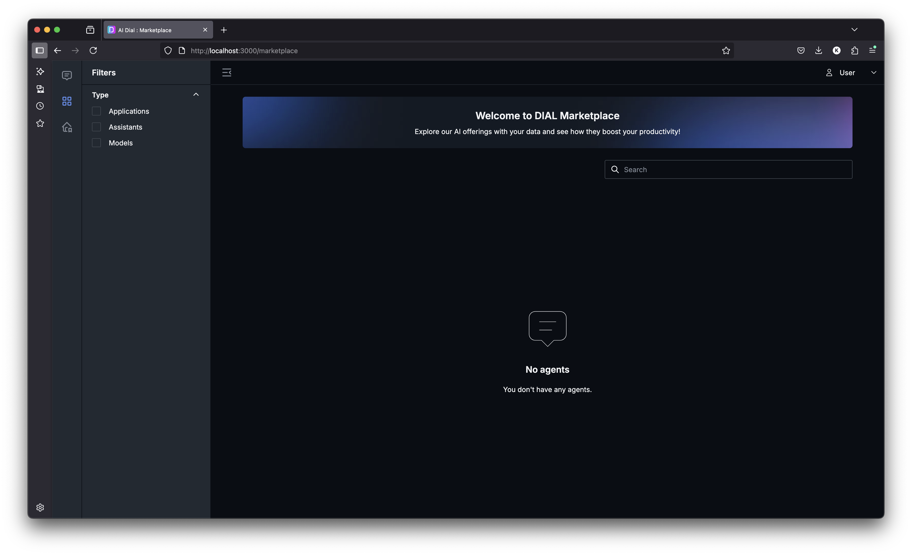

# Add first Echo application

1. Open console and **destroy** compose that we run in **t1** task:
    ```bash
    docker compose down -v --remove-orphans
    ````
2. Open the [echo app](echo/app.py). It is simple application that repeats user's message
3. Open the [echo Dockerfile](echo/Dockerfile). With this we will run container with `echo` app in docker compose
4. Open the [docker-compose.yml](docker-compose.yml). It extends the docker-compose from root and adds new `echo` service that will be built from [echo Dockerfile](echo/Dockerfile)
5. Open console and move to `/tasks/t2` folder:
    ```bash
    cd ./tasks/t2/
    ```
6. Run docker-compose
    ```bash
    docker compose up -d
    ```
7. Check that it is up 
    ```bash
    docker compose ps -a
    ```
8. Open in browser [local dial chat](http://localhost:3000/marketplace) and check that it works.
There will be absent echo application, we need to add it to configurations👇


10. Open the [config](core/config.json) and add:
    - Into `applications`:
        ```
        "echo": {
              "displayName": "My Echo App",
              "description": "Simple application that repeats user's message",
              "endpoint": "http://echo:5000/openai/deployments/echo/chat/completions"
            }
        ```
11. Restart the compose:
    ```bash
    docker compose down && docker compose up -d --build
    ```
12. Open in browser [local dial chat](http://localhost:3000/marketplace) and check that My Echo App has been added to marketplace

13. Use echo application and type:
    ```text
    Hooray, eventually the Echo app running in Docker container is up
    ```
    