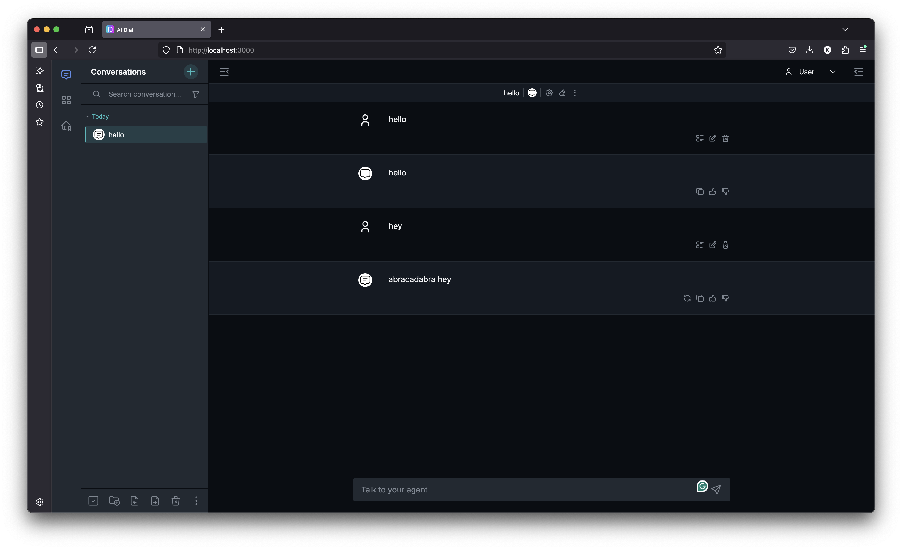

# Test Echo application with local run

1. Open console for `/tasks/t3/` and **destroy** compose that we run in **t2** task:
    ```bash
    docker compose down -v --remove-orphans
    ````
> As you can see we have [echo app](echo/app.py) and don't have any Dockerfiles and compose as well. We will work from now with `docker-compose.yml` in the project root

> It will be hard to create any application when we run it in docker container (takes time to rebuild, need to play with debug). 

> From now we will run application from IDE and configure Core to be able to work with locally running application

2. Open the `/core/config.json` (in root) and add configs for echo app:
   - Into `applications`:
       ```
       "echo": {
             "displayName": "My Echo App",
             "description": "Simple application that repeats user's message",
             "endpoint": "http://host.docker.internal:5022/openai/deployments/echo/chat/completions"
           }
       ```
> Pay attention that we make `host-based access` and accessing the service through Docker's special hostname that resolves to the host machine's IP address from within a container.
3. Run docker-compose (root docker compose)
    ```bash
    docker compose up -d
    ```
4. Create `venv` and run:
    ```bash
    cd ./tasks/t3/echo/
    ```
    ```bash
    pip install -r requirements.txt
    ```
5. Run application (via console or in IDE)
    ```bash
    python app.py
    ```
6. Open in browser [local dial chat](http://localhost:3000/marketplace) and test Echo app
   
   
7. Open the [echo app](echo/app.py) and replace **18 row** `choice.append_content(last_user_message.content or "")`with:
    ```python
    choice.append_content(f"abracadabra\n{last_user_message.content}" or "Oops...")
    ```
8. Restart **Echo application** (in IDE or via console), **DO NOT** restart docker compose!
9. Open in browser [local dial chat](http://localhost:3000/marketplace) and test Echo app again, check that `abracadabra` is there:
   

## The main goal of this task:
> The main goal is to show you that you can configure application in Core config and run it in IDE and have the latest 
> changes with one reload of app in IDE. With such config you don't need to rebuild the app container, and it is easy to debug

> Also, you can add as many apps as you want in one config
