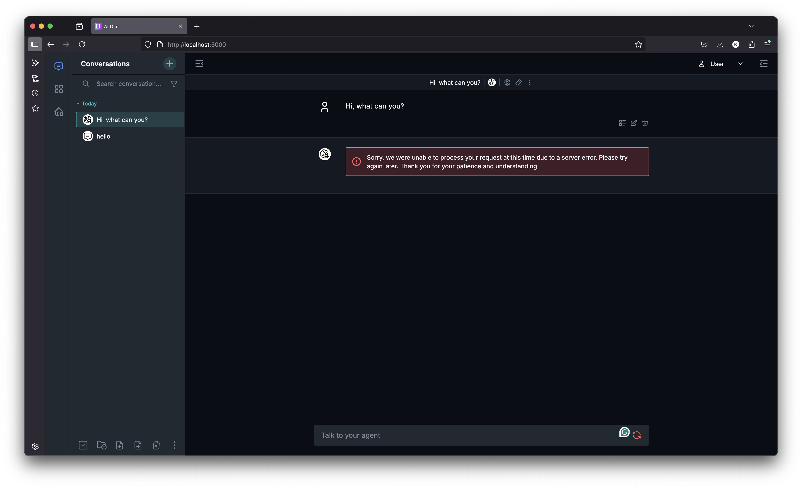
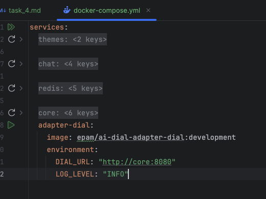
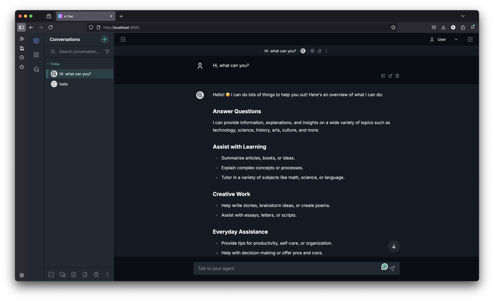
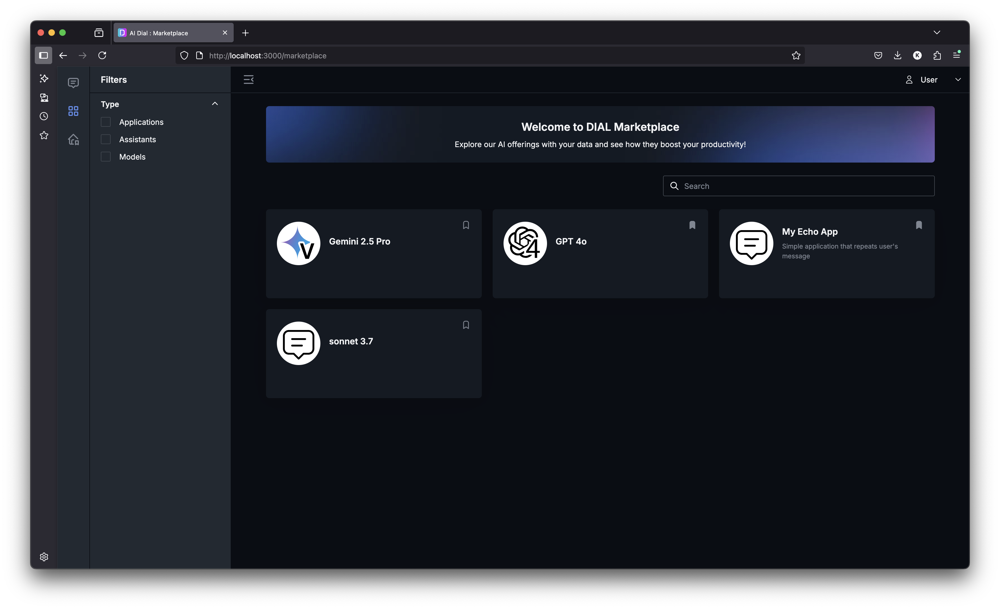
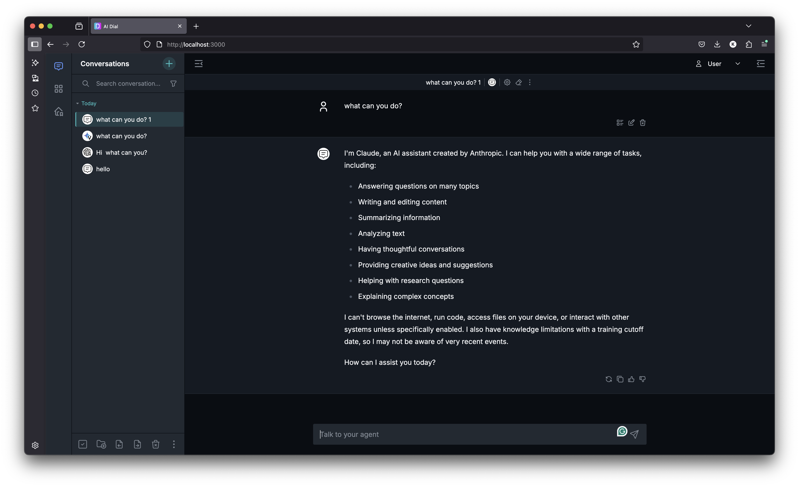
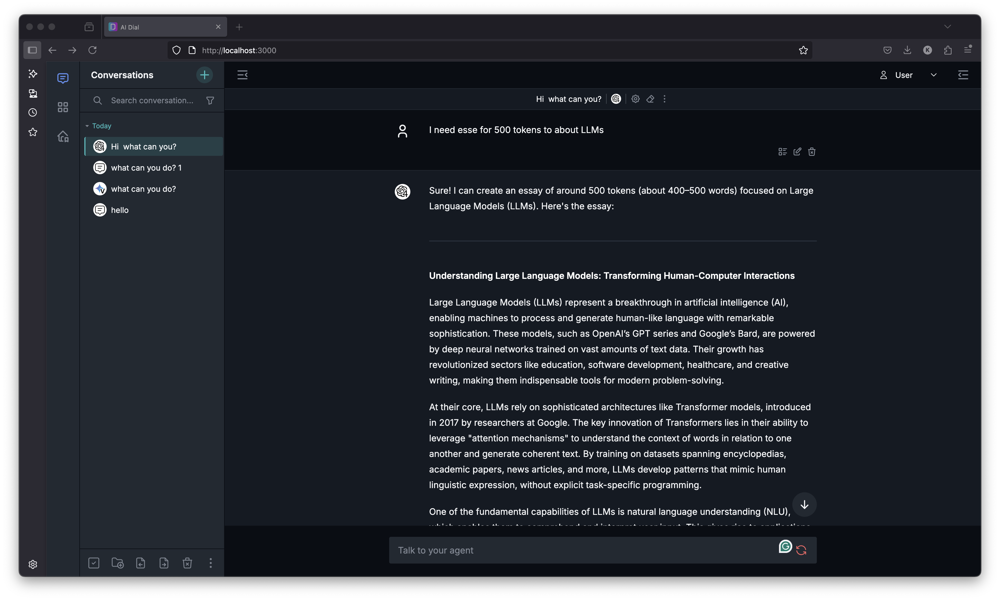
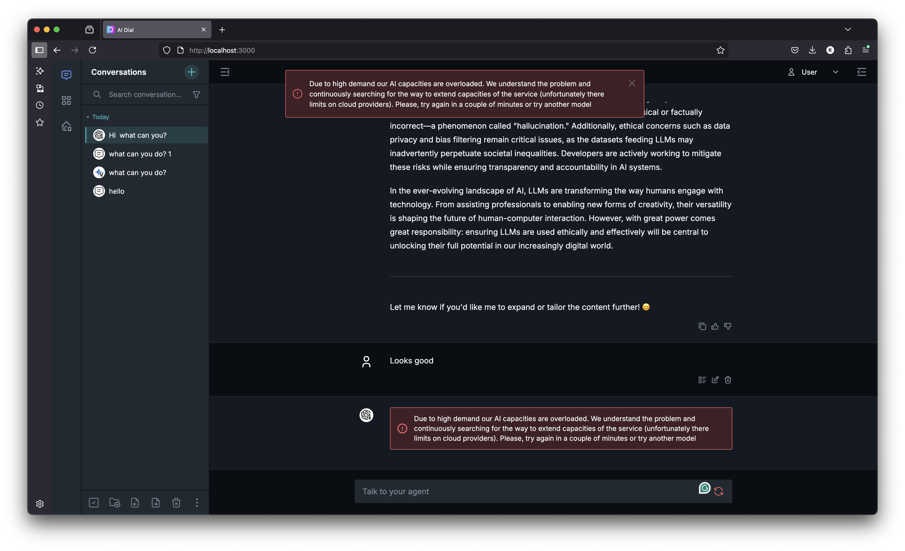

# Time to add models

1. Open the `/core/config.json` (in root) and add configs for echo app:
    - Into `models`:
        ```
            "gpt-4o": {
              "displayName": "GPT 4o",
              "endpoint": "http://adapter-dial:5000/openai/deployments/gpt-4o/chat/completions",
              "iconUrl": "http://localhost:3001/gpt4.svg",
              "type": "chat",
              "upstreams": [
                {
                  "endpoint": "https://ai-proxy.lab.epam.com/openai/deployments/gpt-4o/chat/completions",
                  "key": "{REPLACE_WITH_YOUR_API_KEY}"
                }
              ]
            }
        ```
> In `upstreams` we need to configure `endpoint` and `key` (DIAL API Key). Don't forget to replace `{REPLACE_WITH_YOUR_API_KEY}` with your api key
2. Run docker-compose (root docker compose)
     ```bash
     docker compose stop && docker compose up -d --build
     ```
3. Open in browser [local dial chat](http://localhost:3000/marketplace) and test GPT 4o model
    ```text
    Hi, what can you?
    ```
   
> **IT SHOULD FAIL!** We need to add dial-adapter to work with it!

3. Add dial-adapter service to docker compose (in root):
    For windows:
    ```yaml
      adapter-dial:
        image: epam/ai-dial-adapter-dial:development
        environment:
          DIAL_URL: "http://core:8080"
          LOG_LEVEL: "INFO"
    ```
   For Mac/Linux:
    ```yaml
      adapter-dial:
        platform: linux/amd64
        image: epam/ai-dial-adapter-dial:development
        environment:
          DIAL_URL: "http://core:8080"
          LOG_LEVEL: "INFO"
    ```


4. Run docker-compose (root docker compose)
  ```bash
  docker compose stop && docker compose up -d --build
  ```
5. Check that adapter-dial is up:
    ```bash
    docker compose ps -a 
    ```
6. Open in browser [local dial chat](http://localhost:3000/marketplace) and test again GPT 4o model


7. Add two more models:
   - Into `models`:
    ```
    "claude-3-7-sonnet@20250219": {
          "displayName": "sonnet 3.7",
          "endpoint": "http://adapter-dial:5000/openai/deployments/claude-3-7-sonnet@20250219/chat/completions",
          "type": "chat",
          "upstreams": [
            {
              "endpoint": "https://ai-proxy.lab.epam.com/openai/deployments/claude-3-7-sonnet@20250219/chat/completions",
              "key": "{REPLACE_WITH_YOUR_API_KEY}"
            }
          ]
        },
    "gemini-2.5-pro": {
          "displayName": "Gemini 2.5 Pro",
          "endpoint": "http://adapter-dial:5000/openai/deployments/gemini-2.5-pro/chat/completions",
          "iconUrl": "http://localhost:3001/Gemini-Pro-Vision.svg",
          "type": "chat",
          "upstreams": [
            {
              "endpoint": "https://ai-proxy.lab.epam.com/openai/deployments/gemini-2.5-pro/chat/completions",
              "key": "{REPLACE_WITH_YOUR_API_KEY}"
            }
          ]
        }
    ```
8. Open in browser [local dial chat](http://localhost:3000/marketplace) and test again `sonnet 3.7` and `Gemini 2.5` models



9. Let's test `limits` config (limits set the limit of tokes that user can use for one API Key):
> "day": "1000000"

> "minute": "256000"

> "week": "1256000"

> "month": "11256000"

   - Update limits for `gpt-4o` (100 tokens per minute are allowed, if we hit the limit with the next request we will get an error):
    ```
    "gpt-4o": {
        "minute": "100"
    }
    ```



10. **Don't forget to remove `limits` for `gpt-4o` after testing!**