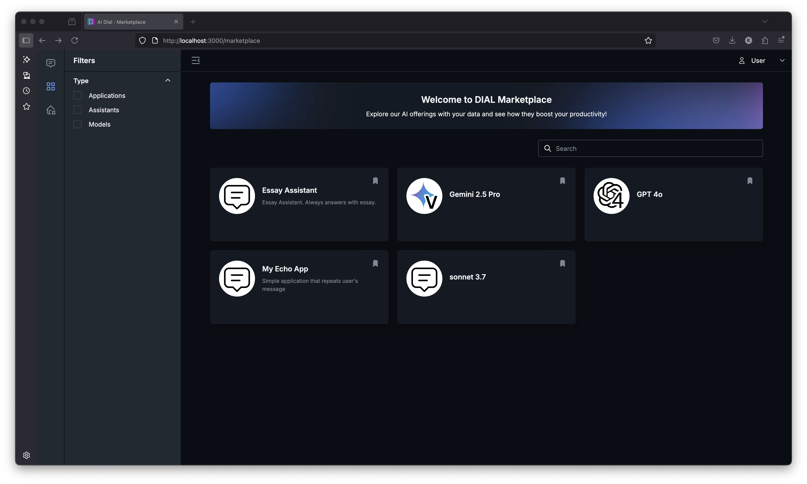
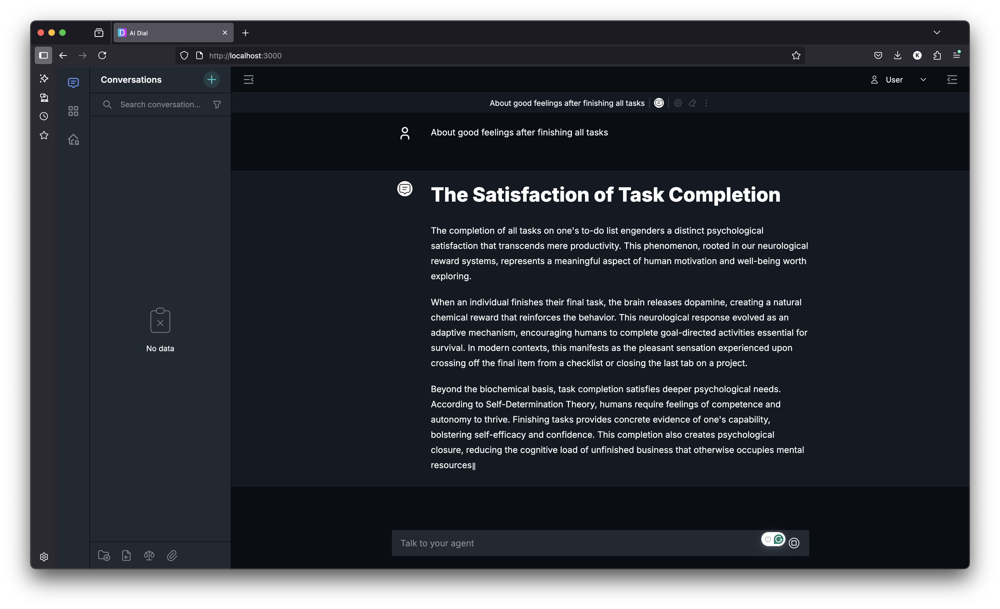

# Create Haiku assistant

1. Open the [essay_app](essay_assistant/app.py)
2. Create `venv` and run:
     ```bash
     cd ./tasks/t5/essay_assistant/
     ```
     ```bash
     pip install -r requirements.txt
     ```
3. Write the flow according described in TODO. Important takes:
    - This app is a simple assistant that have prompt and answers only on the last user message
    - Use `AsyncDial` client. This is special lib created by DIAL to work with different models and applications
    - The response will be streamed to chat
    - We will go to http://localhost:8080 `gpt-4o` since we have configured it for local use (in Core)
    - To understand why `dial_api_key` is used as api key take a look in `core/config.json` we have there such key configured
    - Pay attention that we are using different port `5025`. (You can also experiment with that but don't forget about change it in `core/config.json`)
4. Run application (via console or in IDE)
    ```bash
    python app.py
    ```
5. Now we need to add it to `applications` in `core/config.json`
    ```
    "essay-assistant": {
          "displayName": "Essay Assistant",
          "description": "Essay Assistant. Always answers with essay.",
          "endpoint": "http://host.docker.internal:5025/openai/deployments/essay-assistant/chat/completions"
        }
    ```
6. Restart docker compose:
    ```bash
    docker compose stop && docker compose up -d --build
    ```
7. Open in browser [local dial chat](http://localhost:3000/marketplace), find Essay Assistant and test it
   
   

---
## That's all 🎉